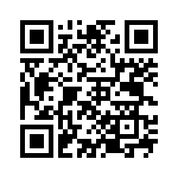
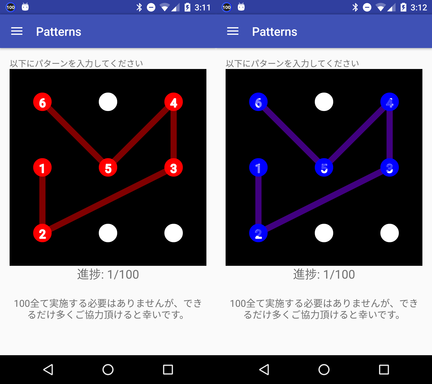
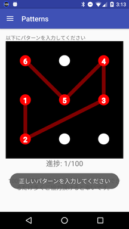
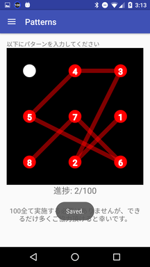

機械学習を用いたパターンロック認証の強化手法の研究
====

概要
----
大学の卒業研究として、既存のパターンロック認証を強化する研究を行っています。

手法として、パターンを入力する際の人間の癖を用いて個人を識別し、認証できないかと考え Deep Learning を用いてパターンロック認証時の軌跡を学習し、本人か否か2クラス分類を行おうと考えています。

そこで、膨大な軌跡データが必要なので、 Android アプリを開発しました。

一人でも多くの方に、ご協力頂けると幸いです。

アプリの説明
----

[https://play.google.com/store/apps/details?id=jp.ww24.handwrites](https://play.google.com/store/apps/details?id=jp.ww24.handwrites)

まずは上記の QR コードまたは、 URL からアプリをインストールしてください。

左が初期画面です。
普段と同じようにスマホを持ち、番号の順になぞってください。

正しくなぞると右の表示になります。

間違えても何度でもやり直せます。

正しくなぞった場合は、次のパターンが表示されるので同様になぞってください。

最後に
-----
全部で100あり、100終わると1に戻ります。

100全て終えるまでに5分ほど掛かってしまうので、20個程度でも大丈夫です。
ご協力宜しくお願いします。
